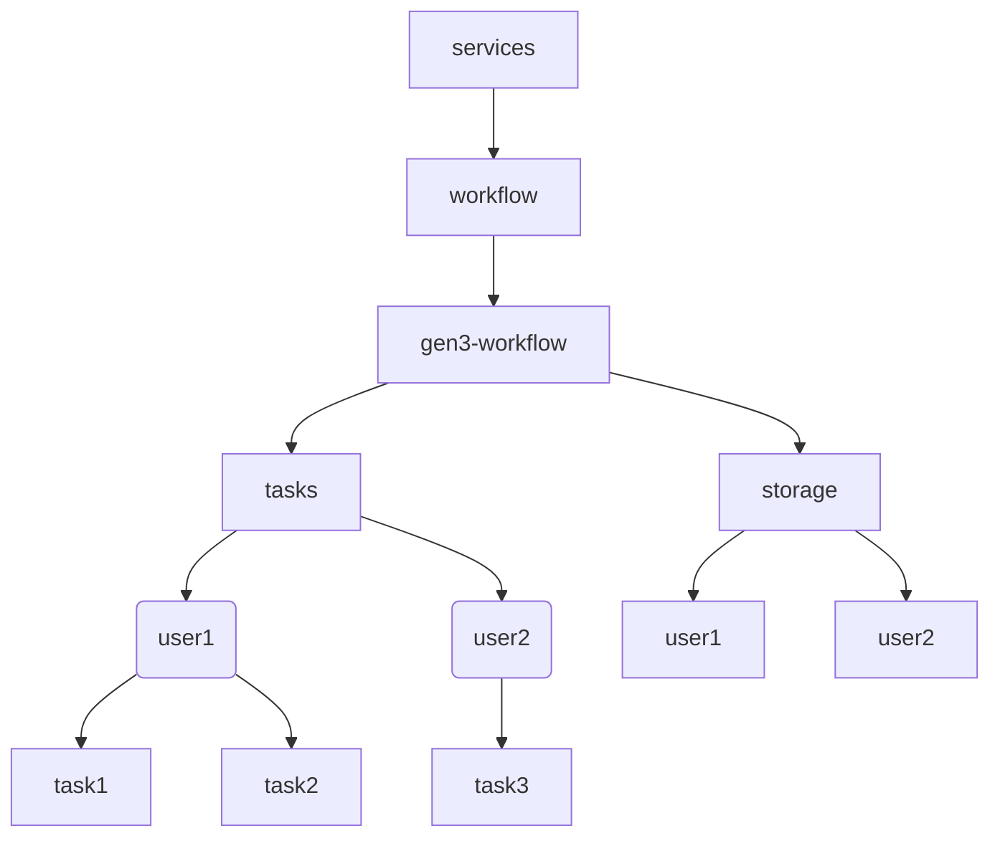

# Authorization

The Gen3 Workflow endpoints are protected by Arborist policies.

Contents:
- [Authorization resources overview](#authorization-resources-overview)
- [Storage](#storage)
- [GA4GH TES](#ga4gh-tes)
- [Authorization configuration example](#authorization-configuration-example)

## Authorization resources overview



## GA4GH TES

- To create a task, users need `create` access to resource `/services/workflow/gen3-workflow/tasks` on service `gen3-workflow`.
- To view a task, users need `read` access to resource `/services/workflow/gen3-workflow/tasks/<user ID>/<task ID>` on service `gen3-workflow`.
- To cancel a task, users need `delete` access to resource `/services/workflow/gen3-workflow/tasks/<user ID>/<task ID>` on service `gen3-workflow`.
- Admin access (the ability to see _all_ users’ tasks instead of just your own) can be granted to a user by granting them access to the parent resource `/services/workflow/gen3-workflow/tasks`.
- This supports sharing tasks with others; for example, "user1" may share "taskA" with "user2" if the system grants "user2" access to `/services/workflow/gen3-workflow/tasks/user1/taskA`.
  - However, sharing task _inputs/outputs_ in the user's S3 bucket is not supported. Currently, users can only access their own S3 bucket.

## Storage
- To upload input files, download output files, and in general manage the files in their S3 bucket, users need `create`, `read` or `delete` access to resource `/services/workflow/gen3-workflow/storage/<user ID>` on service `gen3-workflow`.
- The Funnel workers have access to `/services/workflow/gen3-workflow/storage` so they can manage files in all the user buckets.
- To empty or delete their own S3 bucket (`/storage/user-bucket` endpoints), users need `delete` access to the resource `/services/workflow/gen3-workflow/storage/<user ID>` on the `gen3-workflow` service.

## Authorization configuration example

Users are automatically granted access to `/services/workflow/gen3-workflow/tasks/<user ID>` and to `/services/workflow/gen3-workflow/storage/<user ID>` so they can view and cancel their own tasks and manage files in their own bucket.

```yaml
users:
  some-username:
    policies:
    - gen3_workflow_user

clients:
  funnel-plugin-client:
    policies:
    - gen3_workflow_storage_admin

authz:
  resources:
  - name: services
    subresources:
    - name: workflow
      subresources:
      - name: gen3-workflow
        subresources:
        - name: tasks
        - name: storage

  policies:
  - id: gen3_workflow_user
    description: Allows the creation of workflow tasks
    role_ids:
    - gen3_workflow_creator
    resource_paths:
    - /services/workflow/gen3-workflow/tasks
  - id: gen3_workflow_task_reader_admin
    description: Allows access to view tasks created by all users
    role_ids:
    - gen3_workflow_reader
    resource_paths:
    - /services/workflow/gen3-workflow/tasks
  - id: gen3_workflow_storage_admin
    description: Allows access to manage all the user buckets
    role_ids:
    - gen3_workflow_admin
    resource_paths:
    - /services/workflow/gen3-workflow/storage

  roles:
  - id: gen3_workflow_reader
    permissions:
    - id: gen3_workflow_reader_action
      action:
        service: gen3-workflow
        method: read
  - id: gen3_workflow_creator
    permissions:
    - id: gen3_workflow_creator_action
      action:
        service: gen3-workflow
        method: create
  - id: gen3_workflow_admin
    permissions:
    - id: gen3_workflow_admin_action
      action:
        service: gen3-workflow
        method: '*'
```
