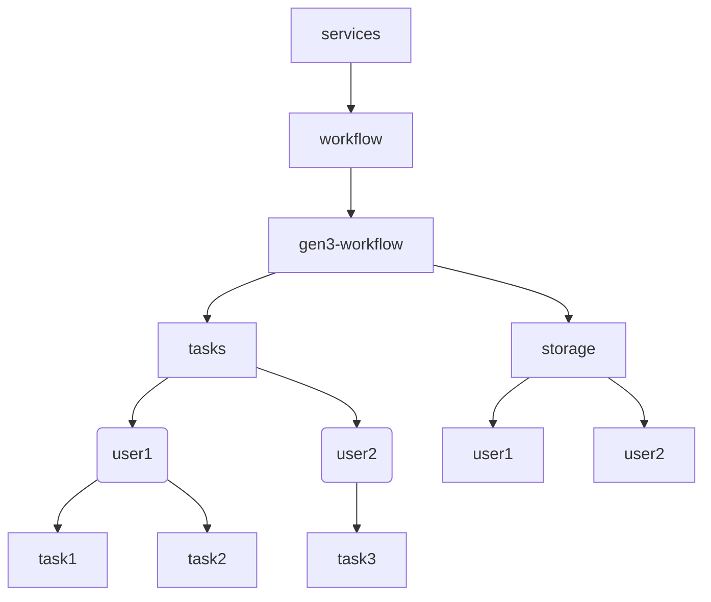

# Authorization

The Gen3 Workflow endpoints are protected by Arborist policies.

Contents:
- [Authorization resources overview](#authorization-resources-overview)
- [Storage](#storage)
- [GA4GH TES](#ga4gh-tes)
- [Client tokens](#client-tokens)
- [Authorization configuration example](#authorization-configuration-example)

## Authorization resources overview


```mermaid
graph TD;
    services --> workflow;
    workflow --> gen3-workflow;
    gen3-workflow --> tasks;
    gen3-workflow --> storage;
    tasks --> user1t(user1);
    tasks --> user2t(user2);
    storage --> user1;
    storage --> user2;
    user1t --> task1;
    user1t --> task2;
    user2t --> task3;
```

## GA4GH TES

- To create a task, users need `create` access to resource `/services/workflow/gen3-workflow/tasks` on service `gen3-workflow`.
- To view a task, users need `read` access to resource `/services/workflow/gen3-workflow/tasks/<user ID>/<task ID>` on service `gen3-workflow`.
- To cancel a task, users need `delete` access to resource `/services/workflow/gen3-workflow/tasks/<user ID>/<task ID>` on service `gen3-workflow`.
- Admin access (the ability to see _all_ users' tasks instead of just your own) can be granted to a user by granting them access to the parent resource `/services/workflow/gen3-workflow/tasks`.
- This supports sharing tasks with others; for example, "user1" may share "taskA" with "user2" if the system grants "user2" access to `/services/workflow/gen3-workflow/tasks/user1/taskA`.
  - However, sharing task _inputs/outputs_ in the user's S3 bucket is not supported. Currently, users can only access their own S3 bucket.

## Storage
- To upload input files, download output files, and in general manage the files in their S3 bucket, users need `create`, `read` or `delete` access to resource `/services/workflow/gen3-workflow/storage/<user ID>` on service `gen3-workflow`.
- The Funnel workers have access to `/services/workflow/gen3-workflow/storage` so they can manage files in all the user buckets.
- To empty or delete their own S3 bucket (`/storage/user-bucket` endpoints), users need `delete` access to the resource `/services/workflow/gen3-workflow/storage/<user ID>` on the `gen3-workflow` service.

## Client tokens

- Tokens obtained through the OAuth2 `client_credentials` flow do not have a `sub` claim. The client itself, identified by the `azp` claim (the client ID), is the principal.
- Clients are subject to the same authorization rules as users, with the client ID taking the place of the user ID in the resource paths above. Like users, clients are automatically granted access to their own tasks and storage.
- Access is granted to clients through the `clients` section of the `user.yaml` file (see example below).
- Note: syncing client policies requires Fence built with gen3authz >= 3.1.2. Older versions can leave a client with no policies when it holds a policy that is not listed in the `user.yaml` file (see [uc-cdis/gen3authz#65](https://github.com/uc-cdis/gen3authz/pull/65)), which is always the case here because of the automatically-granted policies described above.

### Known limitation: client credential rotation

- Gen3 Workflow identifies a client by its client ID. Rotating credentials (`fence-create client-rotate`), or deleting and re-creating a client, produces a new client ID, which Gen3 Workflow treats as a new principal: it starts with an empty task list and a new bucket, and cannot access the previous client ID's tasks or bucket.
- Keying identity to the client _name_ instead would not be safe: names are reusable, so an unrelated client registered later under a deleted client's name would inherit its data.
- For continuity across a rotation, while both credential sets are valid, an admin can grant the new client ID the old identity's policy in Arborist: `POST /client/<new client ID>/policy` with body `{"policy": "gen3_workflow_user_sub_<old client ID>"}`. Fence usersync removes this grant on its next run, so it must be re-applied as needed, or the data copied out during the rotation overlap window.
- The per-client bucket should be treated as working storage: task outputs that must outlive a credential rotation should be copied to permanent storage.

## Authorization configuration example

Users and clients are automatically granted access to `/services/workflow/gen3-workflow/tasks/<user or client ID>` and to `/services/workflow/gen3-workflow/storage/<user or client ID>` so they can view and cancel their own tasks and manage files in their own bucket.

```yaml
users:
  some-username:
    policies:
    - gen3_workflow_user

clients:
  funnel-plugin-client:
    policies:
    - gen3_workflow_storage_admin
  some-client:
    policies:
    - gen3_workflow_user

authz:
  resources:
  - name: services
    subresources:
    - name: workflow
      subresources:
      - name: gen3-workflow
        subresources:
        - name: tasks
        - name: storage

  policies:
  - id: gen3_workflow_user
    description: Allows the creation of workflow tasks
    role_ids:
    - gen3_workflow_creator
    resource_paths:
    - /services/workflow/gen3-workflow/tasks
  - id: gen3_workflow_task_reader_admin
    description: Allows access to view tasks created by all users
    role_ids:
    - gen3_workflow_reader
    resource_paths:
    - /services/workflow/gen3-workflow/tasks
  - id: gen3_workflow_storage_admin
    description: Allows access to manage all the user buckets
    role_ids:
    - gen3_workflow_admin
    resource_paths:
    - /services/workflow/gen3-workflow/storage

  roles:
  - id: gen3_workflow_reader
    permissions:
    - id: gen3_workflow_reader_action
      action:
        service: gen3-workflow
        method: read
  - id: gen3_workflow_creator
    permissions:
    - id: gen3_workflow_creator_action
      action:
        service: gen3-workflow
        method: create
  - id: gen3_workflow_admin
    permissions:
    - id: gen3_workflow_admin_action
      action:
        service: gen3-workflow
        method: '*'
```
