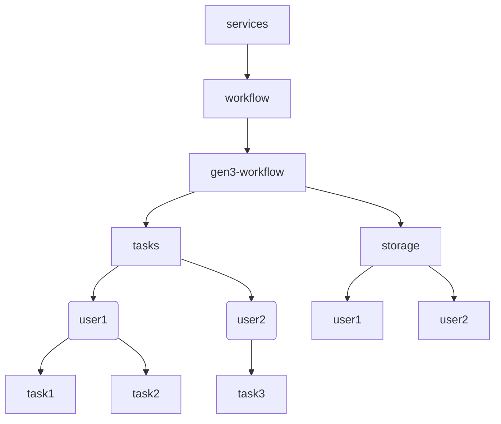

# Authorization

The Gen3 Workflow endpoints are protected by Arborist policies.

Contents:
- [Authorization resources overview](#authorization-resources-overview)
- [Storage](#storage)
- [GA4GH TES](#ga4gh-tes)
- [Client credentials and DPoP](#client-credentials-and-dpop)
- [Authorization configuration example](#authorization-configuration-example)

## Authorization resources overview


```mermaid
graph TD;
    services --> workflow;
    workflow --> gen3-workflow;
    gen3-workflow --> tasks;
    gen3-workflow --> storage;
    tasks --> user1t(user1);
    tasks --> user2t(user2);
    storage --> user1;
    storage --> user2;
    user1t --> task1;
    user1t --> task2;
    user2t --> task3;
```

## GA4GH TES

- To create a task, users need `create` access to resource `/services/workflow/gen3-workflow/tasks` on service `gen3-workflow`.
- To view a task, users need `read` access to resource `/services/workflow/gen3-workflow/tasks/<user ID>/<task ID>` on service `gen3-workflow`.
- To cancel a task, users need `delete` access to resource `/services/workflow/gen3-workflow/tasks/<user ID>/<task ID>` on service `gen3-workflow`.
- Admin access (the ability to see _all_ users' tasks instead of just your own) can be granted to a user by granting them access to the parent resource `/services/workflow/gen3-workflow/tasks`.
- This supports sharing tasks with others; for example, "user1" may share "taskA" with "user2" if the system grants "user2" access to `/services/workflow/gen3-workflow/tasks/user1/taskA`.
  - However, sharing task _inputs/outputs_ in the user's S3 bucket is not supported. Currently, users can only access their own S3 bucket.

## Storage
- To upload input files, download output files, and in general manage the files in their S3 bucket, users need `create`, `read` or `delete` access to resource `/services/workflow/gen3-workflow/storage/<user ID>` on service `gen3-workflow`.
- The Funnel workers have access to `/services/workflow/gen3-workflow/storage` so they can manage files in all the user buckets.
- To empty or delete their own S3 bucket (`/storage/user-bucket` endpoints), users need `delete` access to the resource `/services/workflow/gen3-workflow/storage/<user ID>` on the `gen3-workflow` service.

## Client credentials and DPoP

The Funnel workers authenticate through the `client_credentials` flow and present their token to the S3 endpoint as the AWS access key ID, with the user they are acting for appended to it: `<client token>;userId=<user ID>`. The authorization check then runs against the *client's* policies, not the user's, so a client holding `gen3_workflow_storage_admin` reaches any user's bucket by naming a different user ID.

Such a token is never DPoP-bound, and the clients listed in `DPOP_EXEMPT_CLIENT_IDS` may use one on the DPoP-protected endpoints with no proof. It is therefore an ordinary bearer credential: possession is sufficient, and it is worth more than any one user's token. Keep that list to the clients that need it, keep their policies as narrow as the workflows allow, and keep the token lifetime short. Every request that uses the exemption is logged and counted in the `gen3_workflow_dpop_exempt_requests` metric, labeled by client ID.

Removing the exemption means binding the worker's credential instead. Two options, neither implemented, both needing work in the auth service:

- **DPoP-bound `client_credentials` tokens.** RFC 9449 covers the grant: the client sends a proof to the token endpoint and gets a token carrying `cnf.jkt`. No exemption would be needed, since a bound token already requires a proof on every request. The obstacle is the S3 endpoint - Funnel reaches it through the Minio-go client, which has no way to sign a fresh proof per request.
- **mTLS-bound tokens ([RFC 8705](https://datatracker.ietf.org/doc/html/rfc8705)).** The client authenticates to the token endpoint with a client certificate and the token carries a `cnf.x5t#S256` claim; this service then accepts it only on a connection presenting that certificate. Nothing is signed per request, which suits both a confidential client running in-cluster and the Minio-go path. It needs the client certificate to survive the reverse proxy, for example forwarded as `X-Forwarded-Client-Cert`.

## Authorization configuration example

Users are automatically granted access to `/services/workflow/gen3-workflow/tasks/<user ID>` and to `/services/workflow/gen3-workflow/storage/<user ID>` so they can view and cancel their own tasks and manage files in their own bucket.

```yaml
users:
  some-username:
    policies:
    - gen3_workflow_user

clients:
  funnel-plugin-client:
    policies:
    - gen3_workflow_storage_admin

authz:
  resources:
  - name: services
    subresources:
    - name: workflow
      subresources:
      - name: gen3-workflow
        subresources:
        - name: tasks
        - name: storage

  policies:
  - id: gen3_workflow_user
    description: Allows the creation of workflow tasks
    role_ids:
    - gen3_workflow_creator
    resource_paths:
    - /services/workflow/gen3-workflow/tasks
  - id: gen3_workflow_task_reader_admin
    description: Allows access to view tasks created by all users
    role_ids:
    - gen3_workflow_reader
    resource_paths:
    - /services/workflow/gen3-workflow/tasks
  - id: gen3_workflow_storage_admin
    description: Allows access to manage all the user buckets
    role_ids:
    - gen3_workflow_admin
    resource_paths:
    - /services/workflow/gen3-workflow/storage

  roles:
  - id: gen3_workflow_reader
    permissions:
    - id: gen3_workflow_reader_action
      action:
        service: gen3-workflow
        method: read
  - id: gen3_workflow_creator
    permissions:
    - id: gen3_workflow_creator_action
      action:
        service: gen3-workflow
        method: create
  - id: gen3_workflow_admin
    permissions:
    - id: gen3_workflow_admin_action
      action:
        service: gen3-workflow
        method: '*'
```
