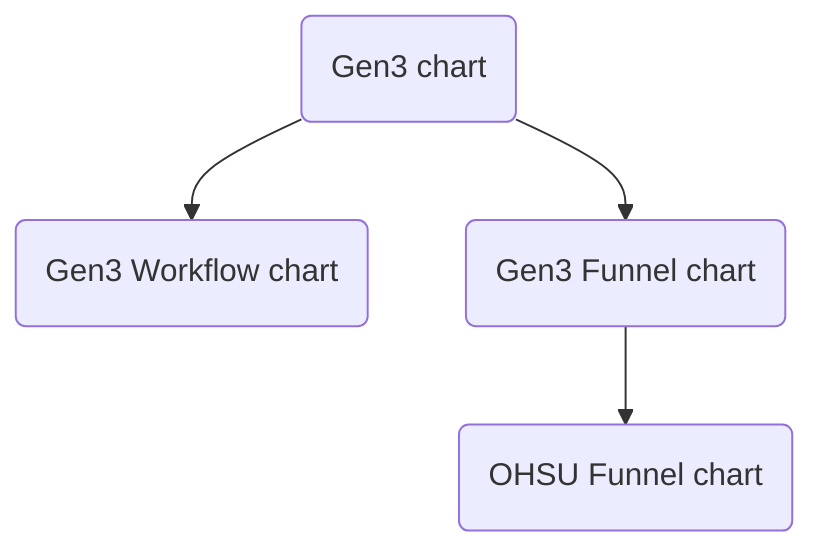
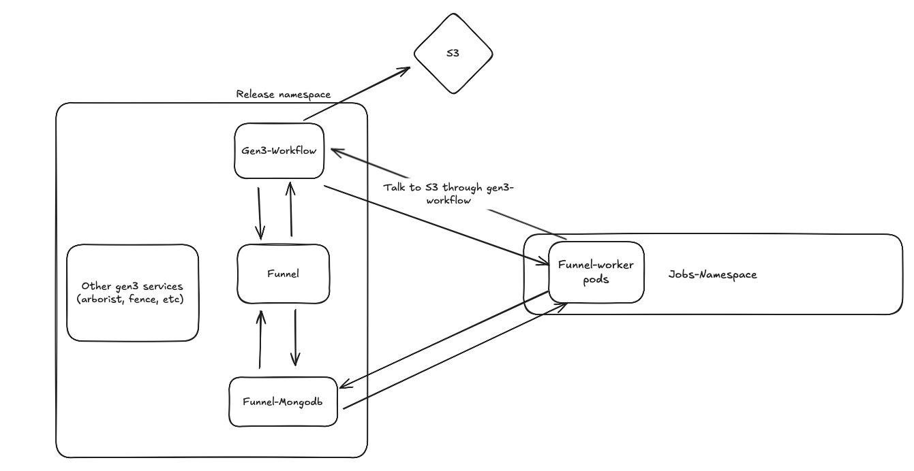

# Helm Chart Architecture

This section describes the key architectural components of the `gen3-workflow` Helm chart and how they interact.

## Introduction

The Gen3 Workflow helm chart is [here](https://github.com/uc-cdis/gen3-helm/tree/03227ec/helm/gen3-workflow) and the Funnel helm chart is [here](https://github.com/uc-cdis/gen3-helm/tree/03227ec/helm/funnel). Both are sub-charts of the [Gen3 chart](https://github.com/uc-cdis/gen3-helm/tree/03227ec/helm/gen3). The Funnel chart is a wrapper for the [OHSU Funnel chart](https://github.com/ohsu-comp-bio/helm-charts/tree/615b829/charts/funnel); its main purpose is the automation of configuration such as a database and an authorization plugin.



## Secrets, External Secrets, and Push Secrets

* The Helm chart provides support for synchronizing secrets with AWS Secrets Manager using:

  * External Secrets [here](https://github.com/uc-cdis/gen3-helm/blob/03227ec/helm/gen3-workflow/templates/external-secret.yaml) and [here](https://github.com/uc-cdis/gen3-helm/blob/03227ec/helm/funnel/templates/external-secret.yaml)
  * Push Secrets [here](https://github.com/uc-cdis/gen3-helm/blob/03227ec/helm/funnel/templates/push-external-secret.yaml)

* These mechanisms are used to manage secrets required by Gen3 Workflow (`gen3-workflow-g3auto`) and Funnel (`funnel-oidc-client`)

* `gen3-workflow-g3auto` is a Kubernetes secret defined in [secrets.yaml](https://github.com/uc-cdis/gen3-helm/blob/03227ec/helm/gen3-workflow/templates/secrets.yaml).
  It contains configuration values derived from `.Values.gen3WorkflowConfig`.

* By default, `gen3-workflow-g3auto` is generated directly from `values.yaml` and **not** pulled from AWS Secrets Manager.
  This behavior is implemented in [secrets.yaml](https://github.com/uc-cdis/gen3-helm/blob/03227ec/helm/gen3-workflow/templates/secrets.yaml).

* This behavior can be changed by setting:

  ```yaml
  .Values.externalSecrets.createK8sGen3WorkflowSecret: false
  ```

  When disabled, the secret is expected to be managed externally (for example, through AWS Secrets Manager).

## Funnel OIDC Job

To enable secure, service-to-service authentication between Gen3 Workflow and Funnel, an OIDC client using the **client-credentials** grant type is created in the Fence database.

This setup is automated using the [funnel-oidc-job](https://github.com/uc-cdis/gen3-helm/blob/03227ec/helm/funnel/templates/funnel-oidc.yaml), which performs the following high-level steps:

1. Verifies that a Fence instance is running in the same Kubernetes namespace as Gen3 Workflow and Funnel.
2. Launches a Fence container (`fence:master`) to manage OIDC client configuration.
3. If a fence client for `funnel-plugin` does not exist, creates a new Fence client (or updates an existing/stale one) and stores the generated `client_id` and `client_secret` in a Kubernetes secret named `funnel-oidc-client`.

This ensures Funnel always has valid credentials to authenticate with Fence without requiring manual setup.

## Funnel `config-updater` Init Container

The purpose of this container is to keep Funnel configuration in sync with Kubernetes-managed secrets.

* Funnel configuration is primarily defined in [funnel/values.yaml](https://github.com/uc-cdis/gen3-helm/blob/03227ec/helm/funnel/values.yaml#L117).

* Some Funnel configuration values are sensitive (for example, database credentials and OIDC credentials) and should not be stored directly in `values.yaml`.

* To address this, all sensitive Funnel configuration is moved into Kubernetes secrets.

* Funnel is configured with a lightweight init container named **`config-updater`**, defined under `.Values.funnel.image.initContainers` ([here](https://github.com/uc-cdis/gen3-helm/blob/03227ec/helm/funnel/values.yaml#L142)).

* At startup, this init container ensures Funnel’s runtime configuration is populated with the latest values from Kubernetes secrets before the main Funnel container starts.

* `config-updater` updates the following:

  1. `JobsNamespace` where Funnel creates jobs
  2. OIDC credentials used by the Funnel plugin
  3. `S3Url` required by the Funnel plugin
  4. Funnel database credentials sourced from the `funnel-dbcreds` secret

## Network Policies

* Funnel dynamically creates Kubernetes resources such as Jobs and ConfigMaps during workflow execution.

* To enforce **least-privilege network access**, dedicated Kubernetes NetworkPolicies are defined.

* These policies:

  * Restrict ingress and egress traffic
  * Ensure only authorized pods and services can communicate with Funnel
  * Reduce the blast radius of misconfigurations or compromised workloads

* The diagram below illustrates the Funnel network policy model when deployed with MongoDB as funnel backend:

> Note: In Gen3, Funnel is now deployed with a Postgres database and the diagram below is slightly outdated.


