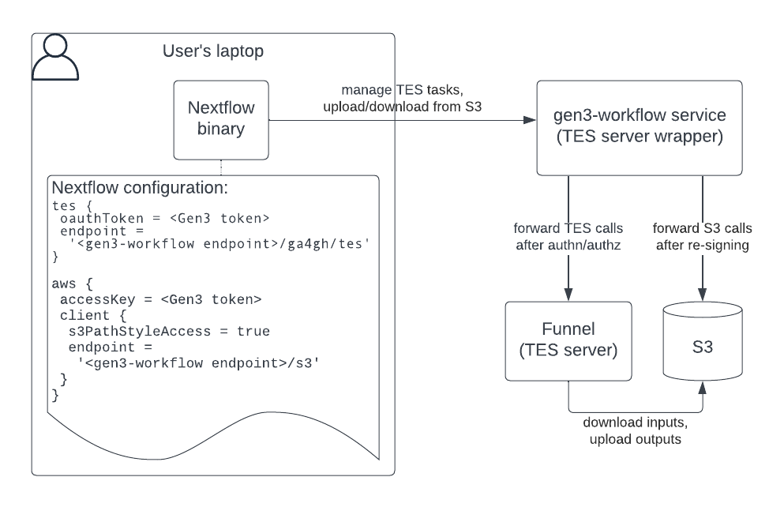

# S3 interaction

Note: This discussion can apply to many use cases, but it is written with a specific use case in mind: using the Gen3Workflow service to run Nextflow workflows.

Contents:
- [Using IAM keys](#using-iam-keys)
- [Using a custom S3 endpoint](#using-a-custom-s3-endpoint)
- [Diagram](#diagram)

## Using IAM keys

We initially considered generating IAM keys for users to upload their input files to S3, retrieve their output files and store Nextflow intermediary files. Users would configure Nextflow with the generated IAM key ID and secret:

```
plugins {
	id 'nf-ga4gh'
}
process {
	executor = 'tes'
	container = 'quay.io/nextflow/bash'
}
tes {
	endpoint = '<Gen3Workflow URL>/ga4gh/tes'
	oauthToken = "${GEN3_TOKEN}"
}
aws {
	accessKey = "${AWS_KEY_ID}"
	secretKey = "${AWS_KEY_SECRET}"
	region = 'us-east-1'
}
workDir = '<your working directory>'
```

Plain-text AWS IAM keys in users' hands causes security concerns. It creates a difficult path for auditing and traceability. The ability to easily see the secrets in plain-text is also a concern.

## Using a custom S3 endpoint

The `/s3` endpoint was implemented to avoid using IAM keys. This endpoint receives S3 requests, re-signs them with internal credentials, and forwards them to AWS S3. Users provide their Gen3 token as the “access key ID”, which is used to verify they have the appropriate access. This key is then overwritten with internal credentials that actually have access to AWS S3.

Nextflow supports S3-compatible storage through the `aws.client.s3PathStyleAccess` and  `aws.client.endpoint` settings, this allows users to point Nextflow to our custom S3 API:

```
plugins {
	id 'nf-ga4gh'
}
process {
	executor = 'tes'
	container = 'quay.io/nextflow/bash'
}
tes {
	endpoint = '<Gen3Workflow URL>/ga4gh/tes'
	oauthToken = "${GEN3_TOKEN}"
}
aws {
	accessKey = "${GEN3_TOKEN}"
	secretKey = 'N/A'
	region = 'us-east-1'
	client {
		s3PathStyleAccess = true
		endpoint = '<Gen3Workflow URL>/s3'
	}
}
workDir = '<your working directory>'
```

Notes:
- We have to set the Gen3 token as the “key ID”, not the “key secret”, in order to extract it from the request. The “key secret” is hashed and cannot be extracted.
- When an `aws.accessKey` value is provided, the Nextflow configuration requires the `aws.secretKey` value to be provided as well. Users can set it to something like "N/A".

## Diagram


